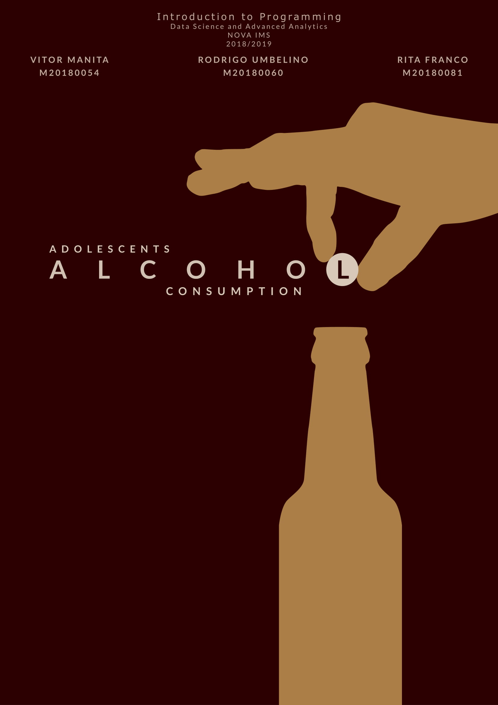

# Analysing Children's alcohol consumption

The purpose of this research was to apply Data Science techniques using Python to a real world problem. The result was a study and identification of real behavior patterns regarding adolescents’ risky behaviours with emphasis on alcohol consumption. The presented data (2013-14) was scraped, collected and transformed from the **World Health Organization**. 

